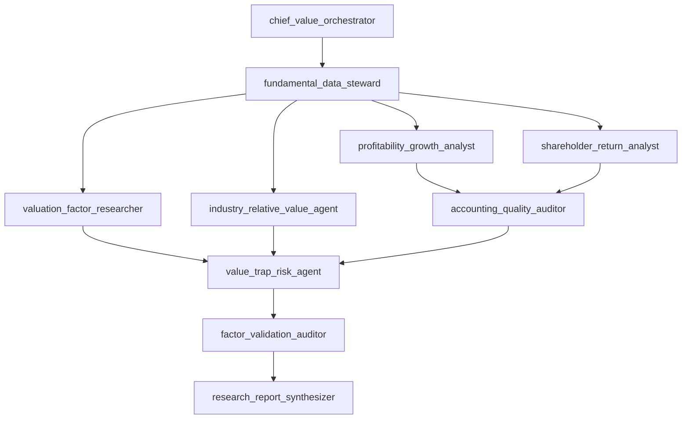

# Fundamental Value Research OS Blueprint

Status: V0.1
Date: 2026-06-12

## Objective

Build a reusable multi-agent quant research system that finds potentially undervalued assets using fundamental factors.

The system should identify candidates, not issue blind buy signals. A candidate is only useful when the reason for cheapness, data quality, validation status, and failure cases are explicit.

## Operating Principle

```text
cheap is not enough
cheap + quality + cash flow + industry context + validation + no value trap = research candidate
```

## Agent Graph



## V0 Score Model

```text
Value Score =
35% valuation cheapness
+ 20% industry-relative undervaluation
+ 15% profitability quality
+ 10% growth stability
+ 10% shareholder return
+ 10% cash-flow safety margin
- value-trap/data-quality/liquidity/ST penalties
```

This is a starting hypothesis, not a validated model. Weight changes require walk-forward or nested OOS evidence.

## Candidate Buckets

- `deep_value_candidate`: very cheap with acceptable safety, but quality may be average.
- `quality_value_candidate`: cheap enough with strong profitability and cash-flow quality.
- `cyclical_value_candidate`: cheap inside industry but needs cycle-specific checks.
- `value_trap_rejected`: cheap for a likely bad reason or not investable.

## Required Candidate Report

Each candidate report must include:

- asset, date, industry, data status;
- composite score and score decomposition;
- absolute valuation thesis;
- industry-relative valuation context;
- profitability and growth context;
- dividend/shareholder-return sustainability;
- accounting quality review;
- value-trap and tradability flags;
- expected-return decomposition:
  `dividend yield + conservative earnings growth + valuation repair`;
- evidence status:
  `candidate`, `research_validated`, `paper_trading`, or `production_candidate`;
- failure cases and demotion triggers.

## Validation Gates

A factor cannot be promoted beyond `candidate` until it has:

- exact universe;
- point-in-time fields with `available_date`;
- IC and RankIC;
- group monotonicity;
- long-short and long-only usefulness;
- yearly, regime, industry, and size-bucket stability;
- neutralized incremental contribution;
- turnover, costs, and capacity;
- OOS or walk-forward validation;
- negative controls and failure-case analysis.

## First Build Plan

1. Create a strict data contract and factor registry.
2. Build an agent orchestrator that can score a small panel and report flags.
3. Add sample smoke tests with synthetic assets to prove the pipeline wiring.
4. Connect real current snapshot data as `research_only`.
5. Add PIT ingestion only after credentials/data source rules are explicit.
6. Add historical validation when PIT panel and total-return labels exist.

## Boundaries From Prior Thread

- Do not compare full-sample current-universe results with PIT OOS results.
- Do not use current industry labels in historical tests.
- Do not use raw unadjusted prices as long-horizon labels.
- Do not hard-delete noisy factors without strong evidence; prefer soft shrinkage.
- Do not treat timing, ETF rotation, or T-trading as proof of undervaluation.
